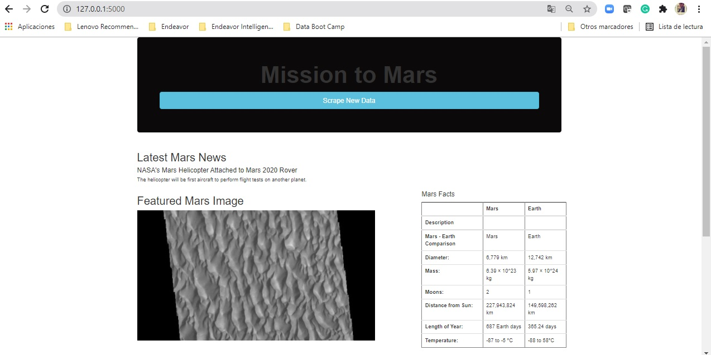
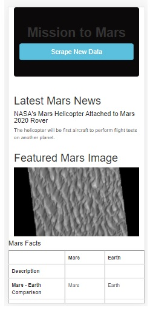

# Mission_to_Mars
Web Scraping to Extract Online Data, Mongo, Flask &amp; Python.

## Objective

The main goal of this challenge is to create a scrapping platform using BeautifulSoup, Splinter, Mongo to store the scraped data on a database, create a web application to display the data, and design the web app, making it mobile-responsive also.

- Image of final Web app:

- Image of mobile-responsive web app:
